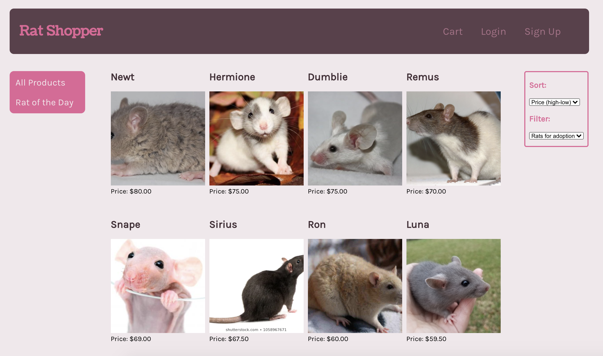
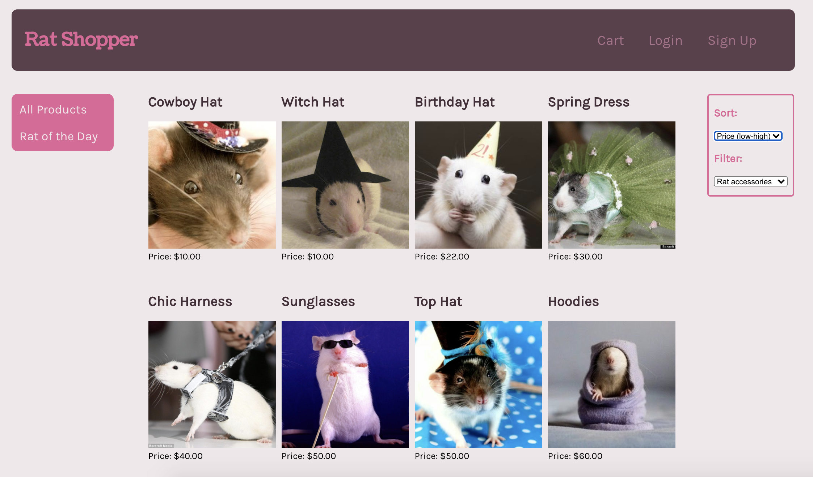
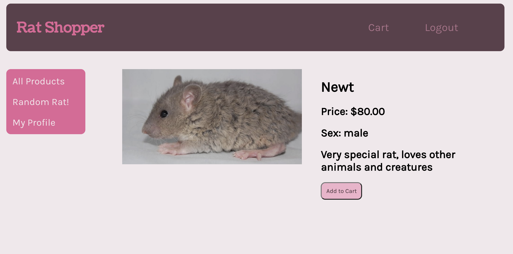
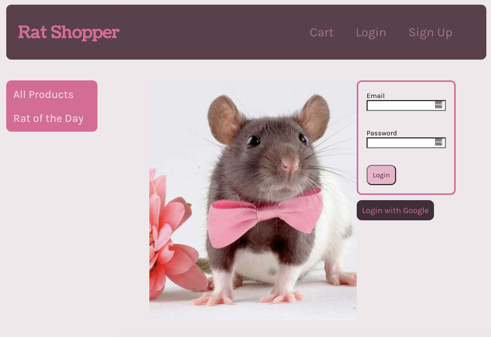
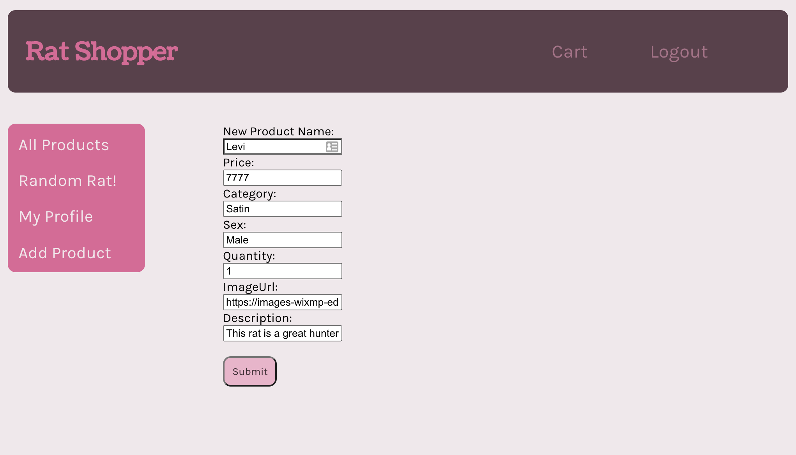

#  **Rat Shopper** 

A lovely e-commerce site where you can adopt your magical rat companion and all sort of accesories for them!

Our app is written in JS, HTML & CSS and powered in the back-end with Express.js, Sequelize, Pg... and in the front-end with React, Redux and a bunch of other styling libraries. For more details, please check-out our repository 😃

## Deployed Website

[Check out our website here!](https://ratshop.herokuapp.com/)

## Authors of the App

This app was brought to you by a group of four full-stack engineers that met at the Grace Hopper Program by FullStack Academy, an immersive Javascript coding bootcamp for women/trans/nonbinary folx. Below are the LinkedIn links to all of us:

[Cecilia Chung](https://www.linkedin.com/in/cecilia-yu-chung-chang/) |
[Liz John](https://www.linkedin.com/in/elizabeth-john-630b761a7/) | [Natalie Ng](https://www.linkedin.com/in/natalie-ng-a812a811b/) | [Emma Seely-Katz](https://www.linkedin.com/in/emma-seely-katz-b4386a1a3/)

## View as Guest

As a guest, one will be able to browse all products with their respective prices and descriptions, add rats and accessories to their cart, and checkout.

You can filter based on categories and sort by price. We have also implemened a "Rat of the Day" functionality to open your mind to more varieties of rats and accessories!

Click on any rat/item to learn more about it:

## View as Logged-in User

As a logged-in user, you can additionally see your profile and past orders. If you don't have an account, you may sign-up for one today!

## Admin Functionality

Admins of the e-Shop can:

* [x] Add new Products

* [x] Edit any product (name, category, price, stock...)

* [x] Delete a Product

## Setup for Production site

Developer Instructions

npm install

createdb rat_shopper

npm run seed // to seed the database

npm run start-dev

